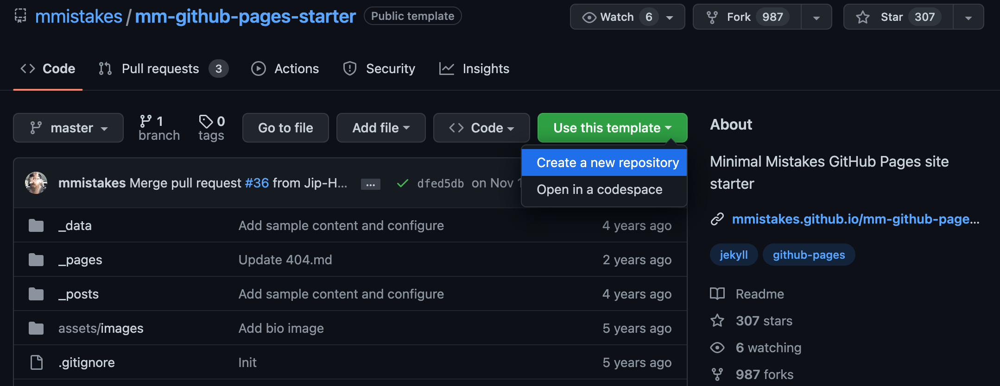
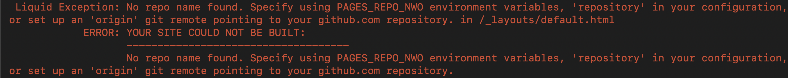

## 前言

这篇文章记录我基于 [Jekyll](https://jekyllrb.com/) 和 [Minimal Mistakes](https://github.com/mmistakes/minimal-mistakes) 主题搭建 GitHub Pages 的方法。几年前我就决定做这件事，但由于一些实际原因一直没有完成。现在很高兴将它写成我的第一篇文章。

网站源码可以在[这里](https://github.com/sshawn9/sshawn9.github.io)查看。

## 技术细节

### Jekyll

按照 GitHub 的建议，我选择了静态站点生成器 Jekyll。学习基本概念时，可以从[分步教程](https://jekyllrb.com/docs/step-by-step/01-setup/)开始。后续开发则可以使用 [Jekyll Docker 镜像](https://hub.docker.com/r/jekyll/jekyll/)完成构建和本地托管。

```bash
# 从 Jekyll Docker 镜像启动容器
# 端口 4000 用于在 http://localhost:4000 本地托管
# 镜像还公开了端口 35729
docker run -itd -p 35729:35729 -p 4000:4000 -v $HOME/workspace/sshawn9.github.io:/jekyll --name jekyll jekyll/jekyll bash

# 进入容器
docker exec -it jekyll bash

# Jekyll 容器中的一些常用命令
bundle init # 创建默认 Gemfile
bundle
bundle update
jekyll serve
```

### Minimal Mistakes 主题

与从零开始相比，选择一个主题更加方便，可以专注于写作而不必过多考虑布局和样式。我一直在寻找优雅的主题，但真正符合要求的往往并不免费。下面是一些主题网站：

- <http://jekyllthemes.org/>
- <https://jekyllthemes.io/>

最终我回到了广为人知、以 MIT 许可证发布且可以免费使用的 [Minimal Mistakes](https://github.com/mmistakes/minimal-mistakes)。可以通过主题模板 [mm-github-pages-starter](https://github.com/mmistakes/mm-github-pages-starter) 创建自己的 GitHub Pages 仓库。



不要遗漏其[故障排查说明](https://github.com/mmistakes/mm-github-pages-starter#troubleshooting)。尝试在本地托管由该模板建立的网站时，可能遇到下面的 Liquid 异常：



修复方法如下：

1. 在 `_config.yml` 中加入以下内容。

```yaml
# 本地托管：
# 修改为自己的设置
PAGES_REPO_NWO: sshawn9/sshawn9.github.io
repository: sshawn9/sshawn9.github.io
```

2. 在 `Gemfile` 中加入以下内容。

```ruby
group :jekyll_plugins do
  gem "kramdown-parser-gfm"
  gem "webrick"
end
```

更多信息参见[这里](https://github.com/jekyll/github-metadata/blob/main/docs/configuration.md#configuration)。对于 `No GitHub API authentication could be found. Some fields may be missing or have incorrect data.` 这条警告，我选择忽略。

### 部署到 GitHub

[Jekyll 部署文档](https://jekyllrb.com/docs/deployment/)列出了多种方案，我选择 GitHub Actions。这里是[我的 GitHub Actions 部署配置](https://github.com/sshawn9/sshawn9.github.io/blob/main/.github/workflows/jekyll-gh-pages.yml)。

## 更多信息

- [Minimal Mistakes GitHub Pages 起始站点演示](https://mmistakes.github.io/mm-github-pages-starter/)
- [github-metadata](https://github.com/jekyll/github-metadata)
- [WEBrick](https://jekyllrb.com/docs/configuration/webrick/)

## 网站图标

创建自己的 `_includes/head/custom.html`，具体方法参见[这里](https://github.com/mmistakes/minimal-mistakes/blob/master/_includes/head/custom.html)。

## 待办事项

- [ ] 删除包含 feed 的页脚
- [ ] 尝试不同的默认布局
- [ ] [带目录的文章](https://mmistakes.github.io/minimal-mistakes/layout-table-of-contents-post/)
- [ ] [页头视频](https://mmistakes.github.io/minimal-mistakes/layout/uncategorized/layout-header-video/)、页头图片等
- [ ] 尝试类似[这个示例](https://mmistakes.github.io/minimal-mistakes/docs/quick-start-guide/)的自定义侧边栏
- [ ] 检查搜索引擎优化
- [ ] 进一步了解 frontmatter
